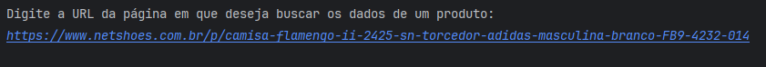
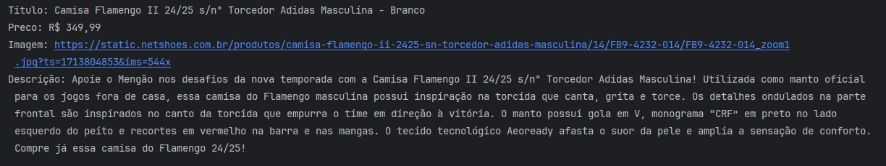

# Teste Técnico - Desenvolvimento Web Scrapper
O objetivo deste teste é criar uma aplicação onde o usuário possa escolher um produto do site https://www.netshoes.com.br/ e extraia algumas informações dele. Após a escolha do produto, o programa retorna as informações deste produto (**título**, **preço**, **imagem**, **descrição**). 

## Ferramentas utilizadas
- Java 17
- Maven
- Biblioteca JSoup
- Biblioteca Json

## Como executar e testar a aplicação
1. Clone este repositório:
```
git clone https://github.com/KayllaneGPina/teste-tecnico-neogrid
```
2. Navegue até o diretório `principal`:
```
cd src\principal
```
3. Execute a classe `Main`
4. Vá até o site da Netshoes e escolha um produto de sua preferencia, copie a URL e cole na aplicação. Exemplo:

5. O resultado será:


---

Feito por [Kayllane Pina](https://github.com/KayllaneGPina).
